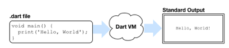
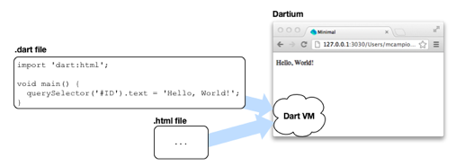
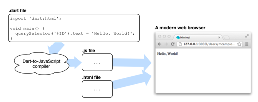

# 关于Dart应用程序

至少在一个Dart应用程序中包含了：

 - 一个 Dart 源文件 - 以 `.dart` 为后缀名，包含了 Dart 代码的文件
 - 一个顶级 `main()` 函数。 这是您的应用程序的入口点。
 
有两种类型的Dart应用程序: **命令行应用程序** 和 **Web应用程序**。 一个命令行应用程序是一个独立的程序， 命令行运行在 Dart 虚拟机的一个终端窗口。 Web应用程序托管在一个Web页面,运行在浏览器中 (直接在浏览器中支持 Dart 或通过编译成 JavaScript ) 。

## 命令行应用程序

Dart 的**命令行应用程序**可以在命令行独立运行, 不依赖于 Web 浏览器。 **命令行应用程序**通常用于提供给服务器端来支持一个 **Web 应用程序**,但是它们也可以被用于脚本。 Dart 虚拟机不用中间编译可以直接运行 Dart 代码。

更为简便的是,您可以通过直接在 Dart 编辑器中点击 `Run button` 来运行**命令行应用程序**。另外,可以使用 Dart 安装目录下的 `dart-sdk/bin` 目录中的 Dart 虚拟机工具。

## Web应用程序

Dart 的 **Web 应用程序**在浏览器页面中运行。除了 Dart 文件，Web 应用程序都需要一个 HTML 文件来进行托管。通常情况下,一个 **Web 应用程序**给服务器提供了一个客户端用户界面。

你可以在 Dart 编辑器中通过点击 `Run button` 来运行 Dart 的 **Web 应用程序**。默认情况下, Dart 编辑器调用已经嵌入了 Dart 虚拟机的 **Dartium** ,并加载 HTML 文件,从而加载应用程序。

如果你想在一个不支持 Dart 的浏览器中查看你的 **Web 应用程序**, 你可以使用 **Dart-to-JavaScript 编译器**把你的 Dart 代码编译成 JavaScript , 这些 Dart 代码在 Dart安装目录的 `dart-sdk/bin` 目录中。 然后将生成的 JavaScript 文件加载到浏览器中。 

**Dart 编辑器**提供了一个方便的菜单选项用来运行像 JavaScript 这样的 **Web 应用程序**。

本教程的其余步骤将首先通过创建和运行一个**命令行应用程序**来演示,然后再创建和运行一个 **Web 应用程序**。