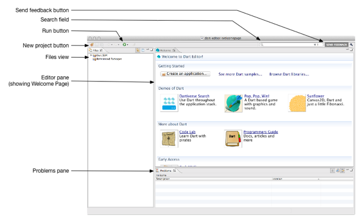

# 运行 Dart 编辑器

在你的安装目录中通过双击它的图标  来调用 Dart 编辑器。


Dart 编辑器在 `Editor pane` 的选项卡中显示它的欢迎页面 。

Dart 编辑器包括以下功能:

## 发送反馈按钮

你可以直接与 **Dart 编辑器团队**分享 Bug 和请求，特别是比较大的 Dart 团队。

## 搜索字段

在文件视图中通过输入文本搜索每一个文件。 搜索的结果显示在一个搜索视图中。 在这个视图中, 双击一个文件，就可以在编辑器窗格中看到它。 文件中所有的跟搜索字符匹配的文子在编辑器窗格中都突出显示。

## 运行按钮

运行与文件视图中选中的文件相关联的应用程序。

## 新建项目按钮

创建一个目录，在创建的目录中包含了一个新的应用程序的文件。 您也可以使用 `File > New Project` 菜单项或欢迎页面上的 `Create an application` 按钮。

## 文件视图

展示了 Dart 程序的层次视图及其相关文件。 在文件视图中双击一个文件可以在编辑器窗格中查看它的内容。 如果您在文件视图中单击一个文件, 这个文件就会被选中, 但不会是显示在编辑器窗格中。 你必须双击该文件才会显示。

## 编辑器窗格中

提供了你期望的基本编辑功能, 并附带了一些特性,比如 Dart 代码自动完成, API 浏览,对重构的支持。 当你第一次使用 Dart 编辑器, 它会在编辑器窗格中显示欢迎页面, 它提供了快速访问Dart 资源和一些漂亮的样本。 欢迎页面也可以从工具菜单下打开。

## 问题面板

显示警告和错误消息。

>有问题?查看 [Dart 编辑器故障排除](https://www.dartlang.org/tools/editor/troubleshoot.html)