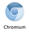
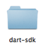


# 下载安装包后你得到了什么?  

你解压该文件所生成的dart安装目录, 包含以下几个:

 
`Dart 编辑器`是一个功能强大的, 轻量级别的，开源的编辑器。 通过它你可以创建和编辑文件, 管理您的项目的文件和目录, 查找 **API** ，调试你的代码, 在运行环境中通过这个名字的图标可以启动它。

________________________________________
 


`Chromium` 是一个包含了名为 `Dartium` 特殊构建环境的 web 浏览器,。它嵌入了 **Dart VM ( Dart 虚拟机)**。 你可以直接在这个浏览器中运行您的应用程序, 你也可以通过 Dart 编辑器来帮你运行。 从而简化了构建测试的周期。

________________________________________
 


`dart-sdk` 目录包含 Dart 软件开发工具包。 在这里你会找到 Dart 库,如 `dart：code` 和 `dart:html` ，这些对所有应用程序有用的 **API** 。 在 `bin` 目录中包含了几个有用的命令行工具, 如 `Dart-to-JavaScript 编译器`, 和 `Dart 虚拟机的命令行版本`。
 
________________________________________
 


`samples` 目录包含几个 Dart 的 Web 应用程序的完整的源代码。 你可以在 `Dart 编辑器`或你最喜欢的 **IDE** 中尝试运行这些例子。
 
>你可能会注意到一些其他的 Dart 的安装目录。 你现在可以忽略它们。

